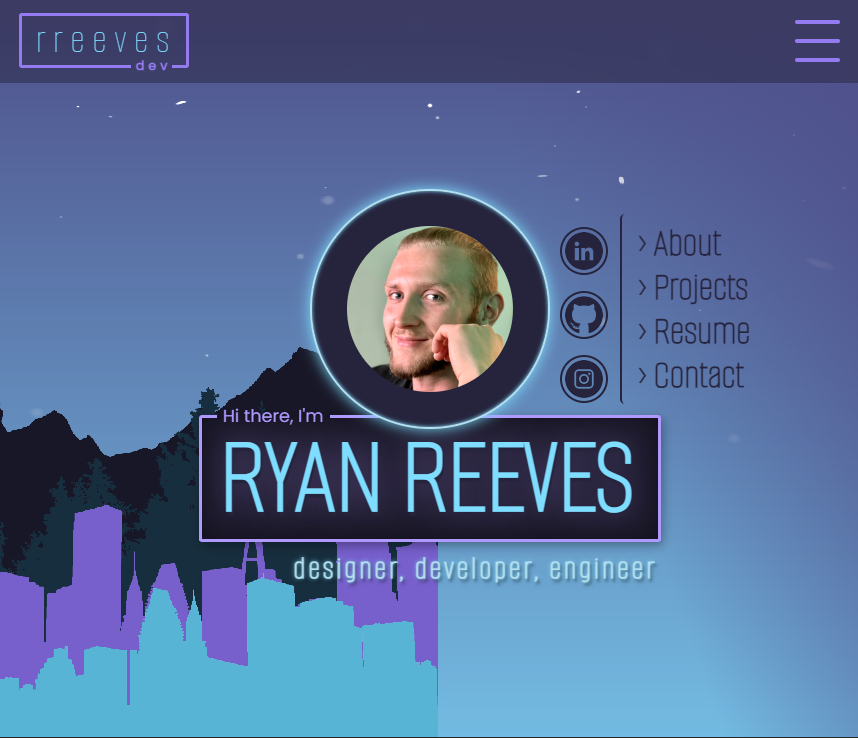

<h1 align="center">React.js Portfolio</h1>

  

    Application created, designed, and published by Ryan Reeves
     
    <a href="https://github.com/rreeves1996/react-portfolio/issues">Report Bug</a>
    ·
    <a href="https://github.com/rreeves1996/react-portfolio/features">Inquire About Features</a>
  

## About

Started during my Full-Stack Development Bootcamp at the University of Washington, iterated many times over. Created with the hopes of having a lasting, impressionable portfolio that can be continually used until another major overhaul.
Though I had made a strong attempt not to use this portfolio as an experiment for React features, the junior developer in me turned this into a smorgasbord of styling experimentation and state nightmares. I started this portfolio with the focus on making it simple as far as styling goes, and...yeah we can see that did not happen. When I started this portfolio during bootcamp, my focuses were:
* Mobile-first, responsive layout
* Simple/sleek yet impressive UI
* Easily iterable framework for future additions and refinement

Overall, this was one of my first applications where I felt like I started with a clear - yet flexible - vision and roadmap in mind, and stuck with it throughout the whole application's development. Looking back now, even though these points of emphasis ended up being up to par for my standards at the time, I would now (months later) consider none of these points to be met - the UI is arguably impressive at the surface, but I would not approach and develop it in the same manner today as I did when this portfolio was created.

## Roadmap

- [x] Create/organize components to improve app performance
    - [x] Create recurring wrapper for background
    - [x] Refactor navbar to make it easily reusable
    - [x] Make portfolio projects in to reuseable component
    - [x] Refactor carousel into component
- [x] Reduce JSX clutter through cleaner component/state management
- [ ] Reorganize file stucture (I'm looking at you, 50 yard long assets images)
- [x] Clean up and minimize CSS for easier refinement in future
- [ ] Make contact form functional (and a modal?)

## Contact

Ryan Reeves - [https://www.linkedin.com/in/rreevesdev/](https://www.linkedin.com/in/rreevesdev/) - rreeves.dev@gmail.com

Project Link: [https://github.com/rreeves1996/react-portfolio/](https://github.com/rreeves1996/react-portfolio/)

(<a href="#readme-top">back to top</a>)

